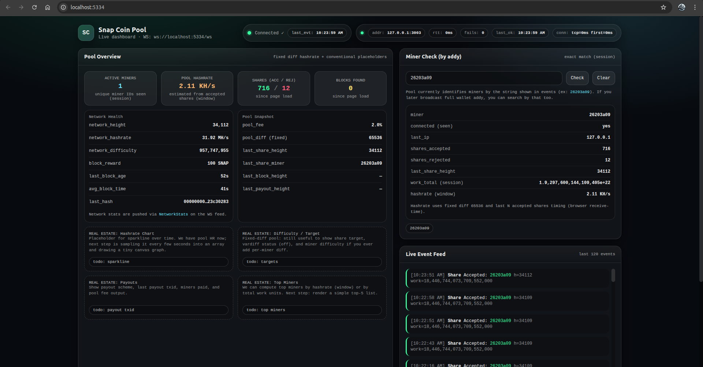
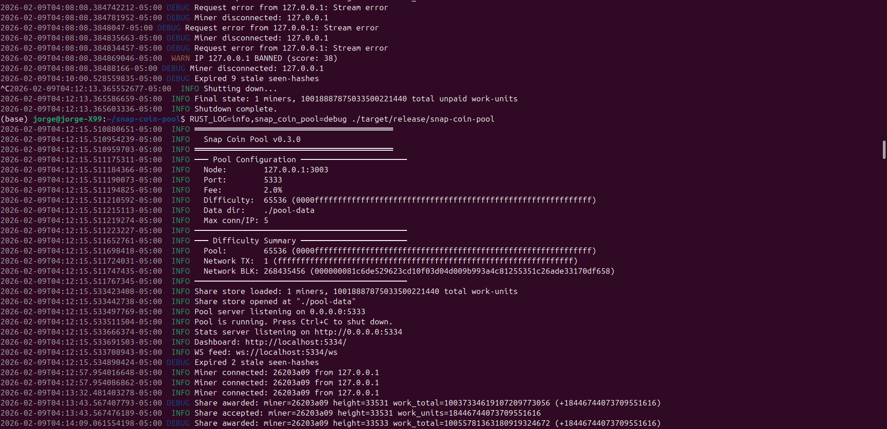

# SnapCoin Pool --- OIEIEIO Branch

This branch contains operational and observability improvements to the
SnapCoin mining pool while remaining fully compatible with the native
SnapCoin binary protocol.

------------------------------------------------------------------------

## Overview

Enhancements in this branch include:

-   API-driven payout distribution
-   Improved share accounting
-   WebSocket statistics server
-   Real-time monitoring dashboard
-   Network statistics display (height, difficulty, hash rate)

**Important:**\
No miner protocol changes were introduced. Existing miners using the
native SnapCoin binary protocol remain compatible.

------------------------------------------------------------------------

## Build

Compile the pool:

``` bash
cargo build --release
```

Resulting binary:

    target/release/snap-coin-pool

------------------------------------------------------------------------

## Run

Example:

``` bash
RUST_LOG=info,snap_coin_pool=debug ./target/release/snap-coin-pool
```

------------------------------------------------------------------------

## First Run Behavior

On first execution, the pool automatically creates operational
directories and storage:

    pool-data/
        shares.db        Share accounting database

    pool-node/
        blockchain/      Local node blockchain data (if configured)
        logs/            Pool runtime logs

The pool generates log files including:

-   Miner connections
-   Share submissions
-   Block events
-   Node health metrics

These directories are intentionally excluded from version control.

------------------------------------------------------------------------

## Dashboard

A real-time dashboard is provided:

    static/pool_dashboard.html

The dashboard connects to the WebSocket stats server and displays:

-   Connected miners
-   Share activity
-   Block events
-   Network height
-   Network difficulty
-   Hash rate metrics

------------------------------------------------------------------------

## Screenshots




------------------------------------------------------------------------

## Directory Layout

    src/
        pool_api_server.rs       Native binary protocol pool server
        pool_stats_server.rs     WebSocket stats + dashboard backend
        handle_share.rs          Share validation / accounting
        handle_block.rs          API payout construction
        share_store.rs           Share persistence

    static/
        pool_dashboard.html      Real-time monitoring UI

------------------------------------------------------------------------

## Protocol

Pool communication uses the **native SnapCoin Request/Response binary
protocol**.

This branch does not modify miner protocol compatibility.

------------------------------------------------------------------------

## Status

Development / experimental branch focused on improving:

-   Observability
-   Operator usability
-   Operational reliability

------------------------------------------------------------------------

## Author

OIEIEIO
